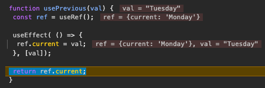

# React Custom Hook

This is part of my learning about *Advanced React* provided by Meta on Coursera.
In this project how to create a custom hook will be illustrated.

## Analyzing The Code
I spent a good amount of time to try understand the code in its completeness, since I don't like leaving grey areas behind.

If you add a `console.log` statement after the custom hook:
```javascript
const prevDay = usePrevious(day);
console.log(prevDay);
```

You will find out that when the `App` component is mounted the `prevDay` will hold the value of `undefined`.

### Why The initial value of prevDay is undefined?
First the `useState` hook is run, setting the `day` state variable to `"Monday"`:
```javascript
const [day, setDay] = useState("Monday");
```


Next the `usePrevious(day)` custom hook was called with the current state as argument.
In the `usePrevious()` function the `useEffect()` is called:
- First, the `const ref = useRef();` is executed which returns `{current: undefined}` since the hook was called without arguments.
- Then, in our surprise, the `useEffect` is not executed because the hook runs only after the components has been rendered.
  - At this point, it does not. The `return` statement of the `App` component hasn't been executed.
  - This doesn't block the flow of the application as `useEffect` will run asynchronously.
- Thus, the `ref.current` is returned which holds `undefined`.
- After, the component renders, the `useEffect` is called, as mentioned, asynchronously.
  - This sets the `ref.current = 'Monday'`


When the state change from `"Monday"` to `"Tuesday"`, the same flow will be executed:
- `useState` will not be run again, as it is ignored after the initial render.
- The `usePrevious('Tuesday')` will be called.
  - Again, the `useEffect()` will not be executed but it will run after the new re-render.
  - Thus, the `ref.current` will be returned, which was set to `"Monday"` from the previous asynchronous execution of the `useEffect()`.

;



# References
- [How to access previous props or state with React Hooks](https://blog.logrocket.com/accessing-previous-props-state-react-hooks/)<br/>
- [A complete guide to the useEffect React Hook](https://blog.logrocket.com/useeffect-react-hook-complete-guide/)